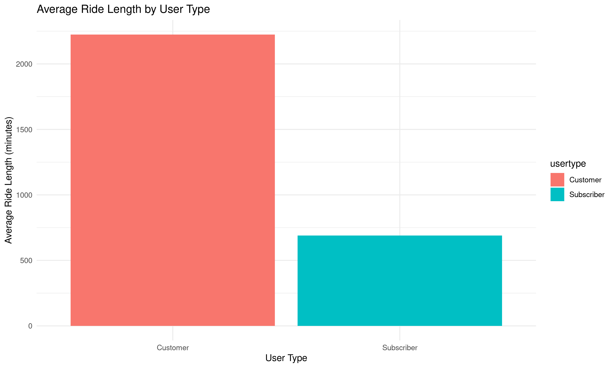
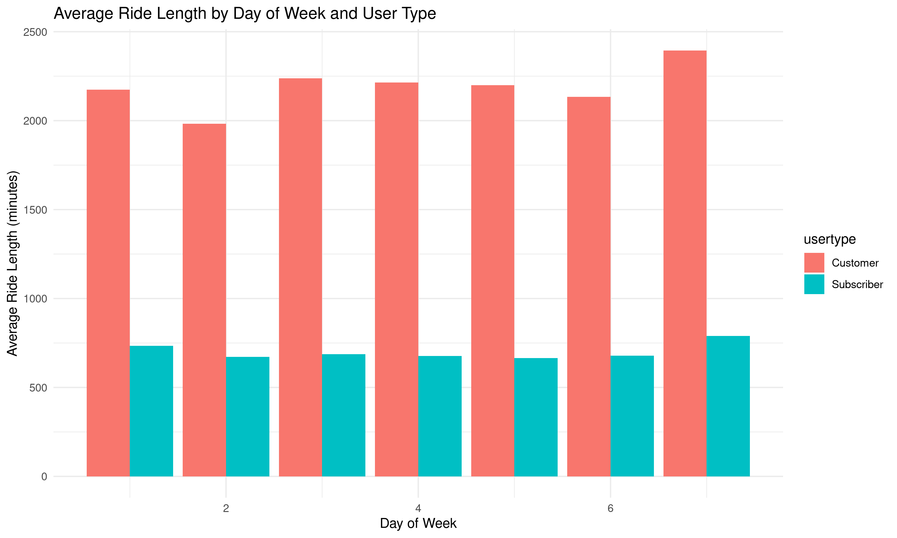

# Cyclistic Bike Share Analysis Case Study

## Question
Case study: How does a bike-share navigate speedy success?

Case Study 1: How does a bike-share navigate speedy success?
In this case study, you will perform data analysis for a fictional bike-share company in order to help them attract more riders. Along the way, you’ll perform typical tasks of a junior data analyst while following the steps of the data analysis process: Ask, Prepare, Process, Analyze, Share, and Act. By the time you’re done, you’ll have a portfolio-ready case study to help you demonstrate your knowledge and skills to potential employers!

Download the packet and reference the details of this case study anytime: [Case Study 1](Case-Study-1.pdf)

---

# Divvy Trips Analysis 2019 Q1

Analysis of Divvy bike-sharing data for the first quarter of 2019. This project explores ride lengths, user types, and usage patterns.


## Overview

This project analyzes the Divvy bike-sharing system data for the first quarter of 2019. Our analysis focuses on ride lengths, user types, and usage patterns to gain insights into how the service is utilized in Chicago. 

## Key Findings

- **Descriptive Statistics**: We performed a comprehensive descriptive analysis to understand the dataset's overall structure, including ride lengths and frequency of use.

- **Ride Length Analysis**: The average, maximum, and modal values of ride lengths were calculated to understand typical user behavior and outliers.

- **User Type Insights**: We examined differences in usage patterns between subscriber and customer user types, revealing distinct behaviors in ride lengths and frequency.

### Visualizations

1. **Average Ride Length by User Type**

   
   
   This bar chart compares the average ride length between subscribers and customers, highlighting the differences in usage patterns based on user type.

2. **Average Ride Length by Day of Week and User Type**

   
   
   This visualization breaks down the average ride length by day of the week and user type, offering insights into how usage varies throughout the week.

3. **Number of Rides by Day of the Week**

   
   
   A line graph showing the total number of rides for each day of the week, illustrating weekly patterns in bike-sharing usage.

## Conclusions

Our analysis revealed significant insights into the Divvy bike-sharing program's usage in the first quarter of 2019. Key takeaways include the difference in ride lengths between user types and the variation in bike usage throughout the week. These findings can help in optimizing bike availability and improving user experience.

## Installation

You need R and RStudio to run this analysis. Additionally, install the following R packages if you haven't already:

```r
install.packages(c("dplyr", "lubridate", "readr", "ggplot2"))
```

## How to Run the Analysis

Clone this repository, open the R Markdown file (`AnalysisofTrips.Rmd`), and knit it to produce the full report.

## Contributing

We welcome contributions from the community. If you have suggestions for improving this analysis, please open an issue or submit a pull request.

## License

This project is licensed under the MIT License - see the [LICENSE](LICENSE) file for details.


